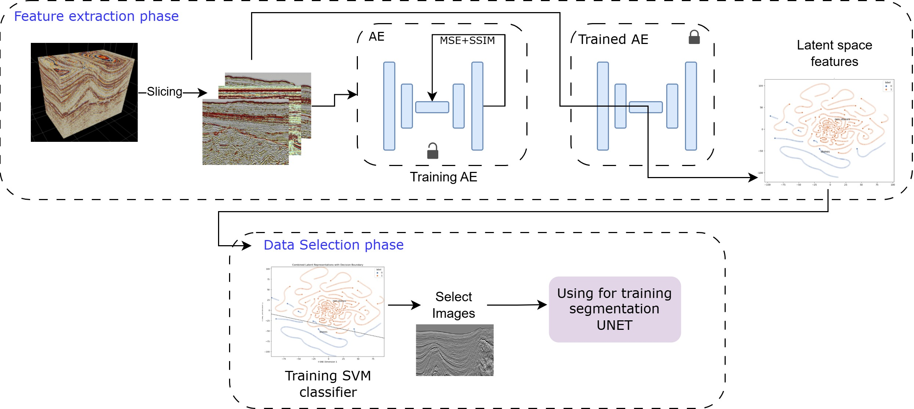

# Latent-Space Data Selection Pipeline

---

## Objective

This project implements a **two-step data-centric pipeline** for seismic slice selection (not tile selection).

 

The goal is to:

1. Extract **latent space features** from seismic volumes using a Convolutional Autoencoder (AE).
2. Use a **latent-space SVM boundary** to identify and remove slices that:
   - Fall from the *bad dataset space* into the good dataset space.
   - Fall from the *good dataset space* into the bad dataset space.

The final output is a **single CSV file** containing slice indices to keep/remove from the original volumes.

---

# Installation

To run the script, you need to be on HPC node and you can source the existing environemnt from the following repo:

```
source /glb/data/gw_export/saltcrawler/DS/ussmrt/tf_gpu/bin/activate
```

If you wish to create a new environment (example with conda) you can instead do so as the  following: 

```bash
conda create -n latent_selection_env python=3.8.19
conda activate latent_selection_env
```
install the dependencies using the following


```bash
pip install -r requirements.txt
```

---

# Pipeline Overview

The pipeline consists of **two separate phases**:

---

# 🔹 PHASE 1 — Feature Extraction Phase

This phase:
- Loads seismic volumes
- Slices them (inline + crossline)
- Trains a Convolutional Autoencoder
- Extracts latent vectors
- Generates a t-SNE visualization
- Saves latent vectors for Phase 2

---

## Step 1: Set Dataset Paths

Open:

```
Model_training_and_analysis.sh
```

Locate the `DATASETS=(...)` section and update your dataset paths, you can enter any number of datasets. Specify the datasets name, followed by path and 
the numbering order for the data:

```bash
DATASETS=(
  "Dataset1" "/ABS/PATH/Dataset1.npz" "/ABS/PATH/Dataset1_label.npz" "0"
  "Dataset2"     "/ABS/PATH/Dataset2.npz"     "/ABS/PATH/Dataset2_label.npz"     "1"
  "Dataset3"     "/ABS/PATH/Dataset3.npz"     "/ABS/PATH/Dataset3_label.npz"     "2"
)
```

---

## Step 2: Run Phase 1

```bash
chmod +x Model_training_and_analysis.sh
./Model_training_and_analysis.sh outputs/run1
```

---

## Phase 1 Outputs

Inside `outputs/run1/`:

- `all_512_512.h5` (Trained Autoencoder)
- `cAE_latent_space.csv` (Latent vectors + metadata)
- `latent_space.npy`
- `latent_tsne.csv`
- `tsne_space.png`

---

Now the user can see the latnet space visually by opening the tsne_space.png file. This gives information about how the datasets deviate in the latnet 
space. This analysis is used for making teh decisions to run the next phase which is the data selection phase.

# 🔹 PHASE 2 — Data Selection Phase


## Step 1: Set Paths and Bad Dataset Label

Open the following file:
```
data_selection.sh
```

In this file, set the paths

```

OUTDIR="path/where/to/save/outputs"
LATENT_CSV="path/to/csv/generated/in/phase1"
KERNEL="sigmoid" #kernel choice for SVM
C="0.01" #regularization parameter value
BAD_LABEL_VALUE='0'
```

## Step 2: Run Selection

```bash
chmod +x data_selection.sh
./data_selection.sh
```

---

## Phase 2 Output

- `selection_output.csv`
- `svm_selection_report.txt`

---

## Workflow Summary

```
1. Edit Model_training_and_analysis.sh
2. Run Phase 1
3. Inspect tsne_space.png
4. Run data_selection.sh
5. Use selection_output.csv for segmentation
```

---

